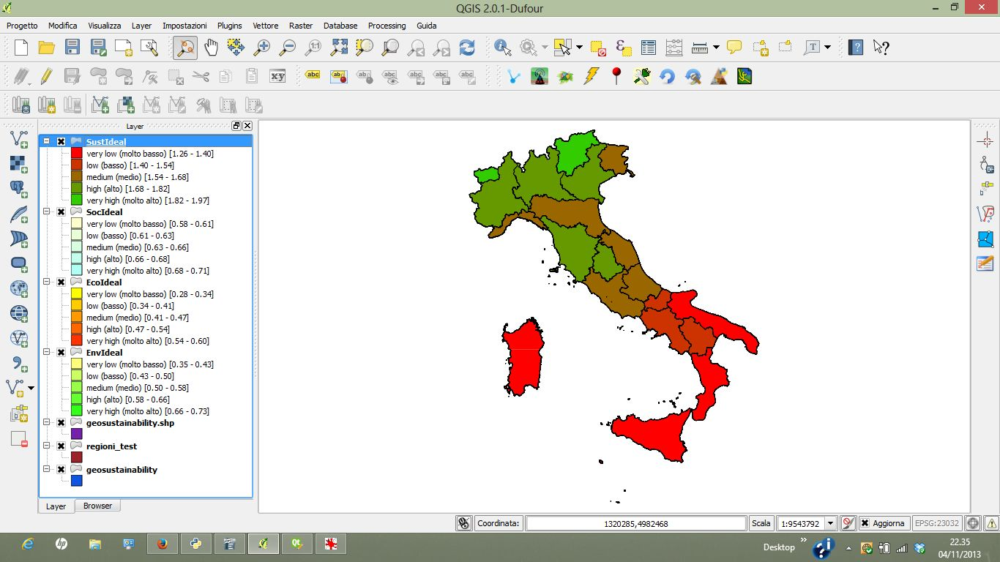

.. geoUmbriaSUIT documentation master file, created by
   sphinx-quickstart on Sun Feb 02 22:41:59 2014.
   You can adapt this file completely to your liking, but it should at least
   contain the root `toctree` directive.

   
geoUmbriaSUIT's Tutorial
=========================================

Tutorial
--------

Step 0 - Load geoUmbriaSUIT
...............................

Load the file “regioni_test”, select it in QGIS  and run geoUmbriaSUIT from the menu: **Plugin/geoUmbriaSUIT/geoUmbriaSUIT** (or pressing the icon on the toolbar).

	 
	 
Step 1 - Setting
....................

The page “Setting” shows the default setting parameters; if the values proposed are acceptable, we can press “OK” button.

.. image:: ./_image/setting.jpg
     :height: 500	
     :align: center
     

	 
Step 2 - Environmental criteria
...................................

The page “Environmental criteria” shows the default values for the environmental assessment. For each criterion  (in the column header) the label , the weight, the preference (cost or gain), the ideal and worst point values are shown as default values. The user can change the values  and with the button “Save”  he can register  the changes.  Pressing the “Apply” button the user run the  calculus for assessment  of environmental index 

	 
Step 3 - Economic criteria
..............................

The page “Economic criteria” has the same structure as the environmental, even the parameters are all the same meaning. With the button “Apply” we can run the model for the assessment of economics index.

.. image:: ./_image/eco.jpg
     :height: 500
     :align: center
	 
Step 4 - Social criteria
............................

The parameters in page “Social criteria” have the same meaning as those in  Environmental and Economics assessment. The user can perform the calculation of social index pressing “Apply” button.

.. image:: ./_image/analysis.jpg
     :height: 500
     :align: center
	 
Step 5 - Output maps
........................

All the indexes are calculated and now we can build the maps and the graph  showing the output. The user has to press **“Load maps”**  button in **"Analysis"** page for to load in QGIS four maps: "EnvIdeal" (Environmental index), "EcoIdeal" (Economics index), "SocIdeal" (Social index) and the overall sustainability index map, named “SustIdeal”. 

.. image:: ./_image/analysis.jpg
     :height: 500
     :align: center

.. note:: Analysis page

	 
.. note:: Output map example 

Step 6 - Output charts
..........................

From the combo box **“Label field”** in the **"Analysis"** page the user has to choose the field of the attributes table that identifies the  name of “research unit” ( eg. the name of the region). Pressing the “Graph” button, geoUmbriaSUIT opens a html page in the browser with four graph. The first shows a stack – histogram whose the overall height is proportional to sustainability value as the sum (linear combination) of the three indexes (environmental, economics and social value).  The second graph is a “bobble-graph” whose position, dimension and colors  of bobbles provide information about sustainability and the its three dimension. In particular, the x-axis Is ordered with the environmental index, the y-axis is ordered with economics index, the color (from red to green) is ordered with social index and the dimension of bobble is proportional with the sustainability value.  The third and the fourth graphs are quite similar to the the first two, but they are “static” and they doesn't require an internet active connection.

.. image:: ./_image/bar_G.jpg
     :height: 500
     :align: center

Step 7 - Extract rules
..........................

The last page, named **“Rules”**,  supply a tool for data  discovery and back analysis of the assessment .Pressing the button “Extract rules”, the user gets the rules derived from  ranking performed from geoUmbriaSUIT, based on five sustainability classes . Selecting a single rule, all the regions that support those rules will be selected in yellow on the maps in QGIS.

.. image:: ./_image/rule_1.jpg
     :height: 500
     :align: center
	 
.. note:: Rules extraction example (rule 12)

.. image:: ./_image/rule_3.jpg
     :height: 500
     :align: center

.. note:: Rules extraction example (rule 2)

	

* :ref:`genindex`
* :ref:`modindex`
* :ref:`search`

. 